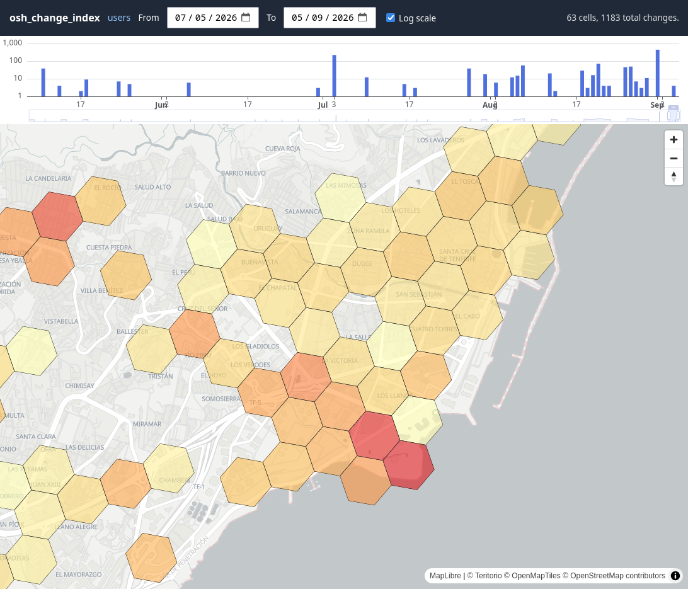
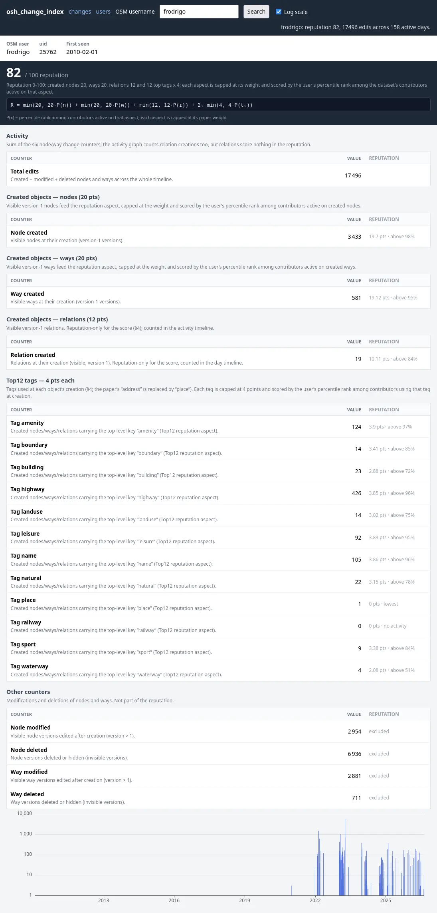

# KarmaMap

KarmaMap reads an OSM full-history file (`.osh.pbf`) and produces one
partitioned Parquet change map - `changes/` - with `(h3_cell, change_date,
count)` rows (node + way changes merged per cell per day), partitioned by
calendar year
(`year=YYYY/data.parquet`, standard hive partitioning), for
bbox + date-range queries (e.g. with DuckDB or the included web frontend).
The `count` of a cell on a day sums the node changes and the way changes, in
the same file per year so a client reads one dataset per year. The
user-indicators pass adds the karma layer: per-user, per-day activity
and a 0-100 reputation per contributor.

The output is queried directly in the browser by two static viewers shipped
in `web/`: a changes map + histogram, and a per-user reputation viewer. The
reputation scoring follows [Neis, Goetz & Zipf, *ISPRS Int. J. Geo-Inf.*
2012, 1(3), 315-332](https://www.mdpi.com/2220-9964/1/3/315).

## What it produces

- `changes/` — `(h3_cell, change_date, count)` counts (node + way changes
  merged per cell per day), partitioned by calendar year.
- `user_indicators.parquet` and `user_reputation.parquet` — per-user, per-day
  activity and reputation, built by every run.





## Documentation

- [HOW_IT_WORKS.md](HOW_IT_WORKS.md) — the internal pipeline: passes,
  business rules, resolution, node cache and the user-indicator
  pass, plus how the bundled web viewers query the data.
- [API.md](API.md) — the Parquet data contract (layout, schemas, encodings)
  for reusers.

## Setup

### Requirements

- Docker with Compose.
- An OSM full-history file (`.osh.pbf`).
- Disk space for the node cache and the Parquet output.

### Configuration

Host paths are read from a `.env` file (see `.env.template`) and used by
`docker-compose.yml`. `DATA_DIR` is mounted at `/data` for the
`karmamap` service — the input file and the `--node-cache` and `--output-dir`
paths are absolute under it — and the `caddy` service serves the
`${DATA_DIR}output` subdirectory read-only at `/data/`. `--output-dir`
must therefore be `/data/output`: the `DATA_DIR` root itself is never
served, so pointing it elsewhere leaves nothing for the web frontend.

```bash
cp .env.template .env
```

```
DATA_DIR=./data/
```

Without a `.env`, the compose defaults `DATA_DIR=./data/` (mounted at `/data`)

Point `--update-url` (or a later diff-update download) at the Geofabrik
*internal* server (`osm-internal.download.geofabrik.de`)? Its extracts carry
user/changeset metadata and full history for OSM contributors only, so it
sits behind an OSM session cookie. Add the OSM account to the same `.env`:

```
OSM_GEOFABRIK_USER=my_osm_login
OSM_GEOFABRIK_PASSWORD=my_osm_password
```

karmamap performs Geofabrik's OAuth2 cookie dance itself from these
credentials, caches the session in the Netscape jar
`<output-dir>/.geofabrik.cookie` (`/data/output/.geofabrik.cookie` in the
container, so it survives runs), probes `<jar>` acceptance against the
server's `cookie_status` endpoint and refreshes it when expired. The jar is
sent on the `state.txt` fetch; the same cookie plumbing is what a later
diff-update download will reuse.

### Build

Base image: Debian (`debian:bookworm` build stage,
`debian:bookworm-slim` runtime stage).

```bash
docker compose --profile=* build
```

### Tests

The C++ tests use Google Test (Debian `libgtest-dev`) and run through CTest.
They are compiled and executed as part of the Docker build stage, so a
failing test fails the image build. Run them manually with:

```bash
docker build --target build -t karmamap:build . \
  && docker run --rm karmamap:build bash -c "ctest --test-dir build --output-on-failure"
```

Build without tests by configuring with `-DOSH_ENABLE_TESTS=OFF`.

### Usage

```
karmamap import <planet.osh.pbf> [options]
karmamap prepare-update --update-url <url> [options]
karmamap update [N] [options]
karmamap help
```

Three verbs, one per stage:

- **import** runs passes 1-3 (nodes, ways, merge) and the user-indicators
  pass, building the `changes/` dataset from an OSM full-history snapshot
  (`.osh.pbf`). It reads the `<base>.state.txt` sidecar next to the snapshot
  (downloaded with wget on the snapshot's day) for its replication
  provenance. It never builds the incremental cache; run `prepare-update`
  for that.
- **prepare-update** builds the `.last` incremental cache from the node cache
  and records the update stream provenance in `manifest.json`. It needs
  `--update-url`: the fetched `state.txt` supplies the starting replication
  sequence. No dataset changes.
- **update** advances an existing dataset along its replication diff stream
  (see below). An optional `N` caps the number of diffs fetched (bare `update`
  or `update 0` catch up to the current `state.txt`).

`karmamap import <file> <file>.state.txt` requires only the sidecar state
file: `--output-dir`, `--node-cache` and `--node-cache-last` all have
defaults (`data/output`, `<output-dir>/../node_positions.cache` =
`data/node_positions.cache`, and `<node-cache>.last`).

#### Options

| Option | Description |
|---|---|
| `--node-cache <file>` | Node position cache file (import/prepare-update): wiped and rebuilt by pass 1, read by pass 2 and by prepare-update. Default `<output-dir>/../node_positions.cache`. Not used by update |
| `--node-cache-last <file>` | Incremental cache holding only the last known h3 cell per node — written by prepare-update, read and rebuilt by update. Default `<node-cache>.last` |
| `--output-dir <dir>` | Output directory for the Parquet datasets (created if missing), default `data/output` |
| `--update-url <url>` | Osmosis replication update URL (e.g. `https://osm-internal.download.geofabrik.de/africa/canary-islands-updates/`); required by prepare-update, optional override in update (must match the recorded source). At import it only records the update stream URL in `manifest.json`: the sequence number and timestamp come from the snapshot's `<base>.state.txt` sidecar (wget the state.txt on the osh's day). prepare-update and update instead fetch the live `state.txt` from this URL |
| `--cookie <jar>` | Netscape cookie jar for the Geofabrik internal server, default `<output-dir>/.geofabrik.cookie`. Only consulted when `--update-url` points at `osm-internal.download.geofabrik.de`: karmamap obtains/refreshes the jar from the OSM account in `OSM_GEOFABRIK_USER`/`OSM_GEOFABRIK_PASSWORD` (`.env`) and sends it on the `state.txt` fetch |
| `--pass 1\|2\|3\|all` | Import only: `1` (nodes only), `2` (ways only, requires an already populated node cache), `3` (merge + sort only, requires passes 1 and 2 to have already run), or `all` (default) |
| `--way-batch-mb <mb>` | Import only, way-pass lookup batch budget in MiB (default: `512`) |
| `--h3-resolution <r>` | Resolution of the data cells, 0-13 (default: `9`); must match between import, prepare-update and update (the caches encode cells at this resolution) |
| `--change-group-rows <n>` | Target rows per Parquet row group of the changes dataset (`changes/*/year=*/data.parquet`) (default: `10000`); smaller row groups keep `h3_cell`/`change_date` min-max compact so range-pruning clients download only the pages they need |
| `--indicators-group-rows <n>` | Target rows per Parquet row group of `user_indicators.parquet` (default: `10000`) |
| `--reputation-group-rows <n>` | Target rows per Parquet row group of `user_reputation.parquet` (default: `1000`) |

### Running

Place the input snapshot under `DATA_DIR` (default `data/`). Import also
requires its `<base>.state.txt` sidecar — the osmosis replication state of the
osh's own day, downloaded manually with wget. Upstream `state.txt` is always
the *current* state (too new for an older snapshot), so fetch it on the same
day as the osh and give it the snapshot's base name:

```bash
wget -O data/region.osh.pbf https://example.com/region-latest-internal.osh.pbf
wget -O data/region.state.txt https://example.com/region-updates/state.txt

docker compose --profile=build run --rm karmamap karmamap import /data/region.osh.pbf
```

To resume import after an earlier stage, run the passes one at a time (a
way-only fix-up after a completed run re-runs `--pass 2` — which puts
`ways.parquet` back next to the already-removed `nodes.parquet` — then
`--pass 3`, sourcing node counts from the existing `data.parquet`):

```bash
docker compose --profile=build run --rm karmamap karmamap import /data/region.osh.pbf --pass 1
docker compose --profile=build run --rm karmamap karmamap import /data/region.osh.pbf --pass 2
docker compose --profile=build run --rm karmamap karmamap import /data/region.osh.pbf --pass 3
```

#### Updating an existing dataset

Prepare the incremental cache for updates and (re)record the update stream
from prepare-update's `--update-url`:

```bash
docker compose --profile=build run --rm karmamap karmamap prepare-update --update-url https://osm-internal.download.geofabrik.de/africa/canary-islands-updates/
```

Once a dataset was imported (and its update stream recorded, either at import
with `--update-url` or by `prepare-update`), an update run fetches the
replication diffs between the recorded sequence and a newer `state.txt` (or a
capped number of diffs) from the same update URL and folds them in. The update
URL is taken from the source block recorded in `manifest.json`, so `--update-url`
may be omitted; when passed explicitly it must match the recorded source URL.
The incremental cache (`--node-cache-last`, `<node-cache>.last`) is the update
state that gets read and rebuilt; the full history node cache is not touched:

```bash
docker compose --profile=build run --rm karmamap karmamap update
```

Bare `update` applies every diff up to the current `state.txt`; `update N`
stops after N diffs. Each fetched diff (`<seq>.osc.gz`,
downloaded to `<output-dir>/diffs/`) runs the node and way passes with per-diff
staging files, so a multi-diff run merges everything into `data.parquet` exactly
once.

### Serving the web frontend

The `caddy` service serves everything from a single port `8080`: the web
frontend at the root and the `/data/output` output dir (`${DATA_DIR}output`;
Parquet partitions + `manifest.json`) under `/data/`, with range requests
and permissive CORS on the data path.

```bash
docker compose up
```

Then open `http://localhost:8080/`.

- **`/changes/`** — the changes viewer: a map of aggregated H3 cells and a
  day-by-day histogram. Pan/zoom and the date range re-query automatically
  (debounced).
- **`/users/`** — the users viewer: look up an OSM username to see their
  OSMPatrol reputation (0-100), per-user indicator totals and an edit-activity
  timeline.

Clients read the files with byte-range requests: hyparquet's
`asyncBufferFromUrl` opens each file and fetches the footer, row-group
metadata and pages it needs, so a large file is never downloaded in full. The
server must therefore support `Range` (`206 Partial Content`,
`Accept-Ranges: bytes`). When the frontend and the data are served from
different origins, the data host must also set permissive CORS headers —
the `Caddyfile` used by the bundled `caddy` service sets both:

```
header Access-Control-Allow-Origin "*"
header Access-Control-Allow-Methods "GET, HEAD, OPTIONS"
header Access-Control-Allow-Headers "Range"
header Access-Control-Expose-Headers "Content-Range, Content-Length, Accept-Ranges"
```

The web viewers resolve their data root relative to the page URL: the
`data/` directory one level above `changes/` and `users/`. Frontend and
data share one base path, and in the bundled compose `caddy` serves the
frontend at `/` and `output-dir/` at `/data`.

How each viewer queries the data is documented in
[HOW_IT_WORKS.md](HOW_IT_WORKS.md).

## Testing on a small region before the full planet

Never run directly on `planet-latest.osh.pbf` (~150 GB) without first
validating the pipeline on a small extract.

```bash
wget -O data/canary-islands-internal.osh.pbf https://osm-internal.download.geofabrik.de/africa/canary-islands-internal.osh.pbf
wget -O data/canary-islands-internal.state.txt https://osm-internal.download.geofabrik.de/africa/canary-islands-updates/state.txt
```

Both files must be fetched together: import records the replication state of
the `state.txt` sidecar, so download it on the same day as the osh. On the
internal server both URLs sit behind the OSM cookie; add
`--load-cookies data/output/.geofabrik.cookie` to wget when the jar exists
from an earlier run.

```bash
docker compose --profile=build run --rm karmamap karmamap import /data/canary-islands-internal.osh.pbf
docker compose --profile=build run --rm karmamap karmamap prepare-update --update-url https://osm-internal.download.geofabrik.de/africa/canary-islands-updates/
docker compose --profile=build run --rm karmamap karmamap update
```

Input and Output files size
```bash
124M data/canary-islands-internal.osh.pbf
 23M data/node_positions.cache
  4M data/output
```
